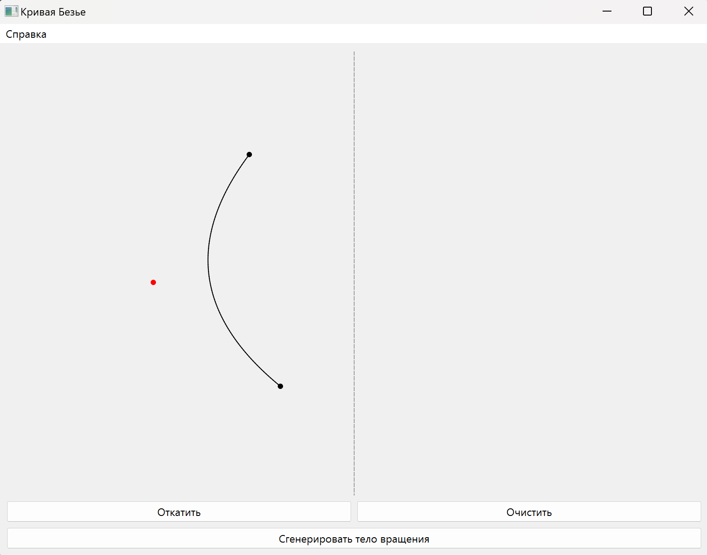
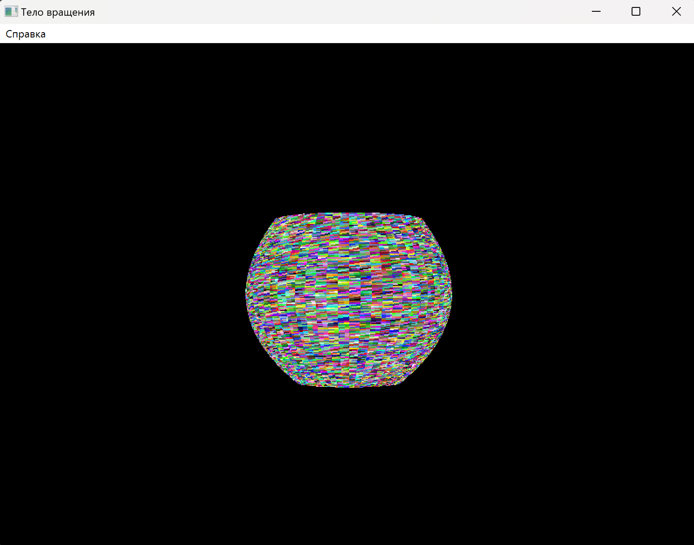
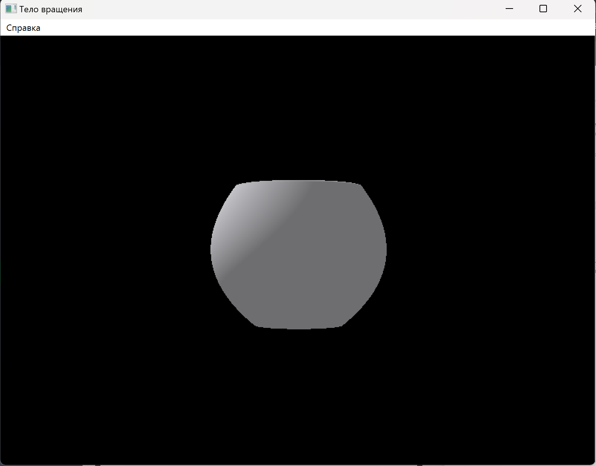
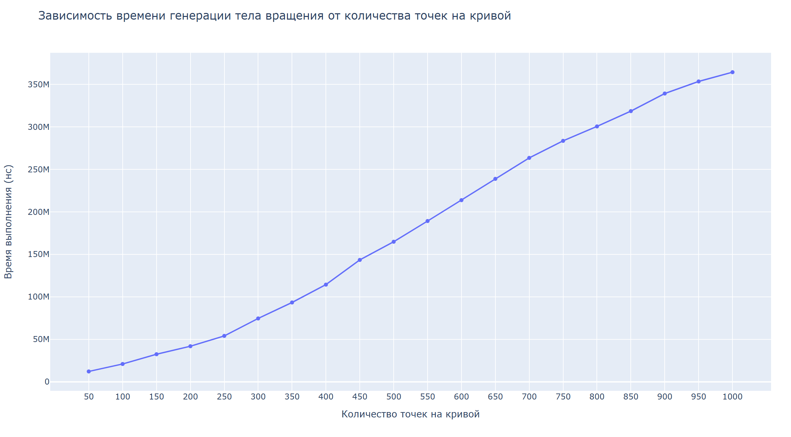
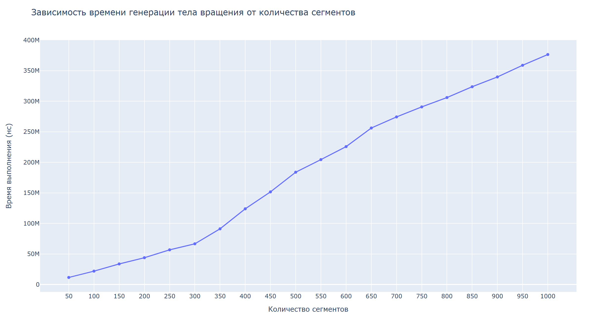

# Курсовая рабоота по компьютерной графике

**Нвзвание:** Визуализация тел вращения, заданных кривой Безье

---

## Документация

[Расчетно-поянительная записка](./docs/rpz/report.pdf)
[Презентация](./docs/presentation/presentation.pdf)

## Техническое задание

Разработать программу, которая генерирует тело вращение с помощью оси вращения и кривой Безье. Кривая Безье задается пользователем. Предоставить возможность изменять положение и направления камеры для наблюдения за телом вращения. Предоставить  возможность изменять положение источника света.

---

## Интерфейс программы

---

## Исследование

---

## Комментарии

код написан относительно плохо, поэтому не советую его не смотреть
